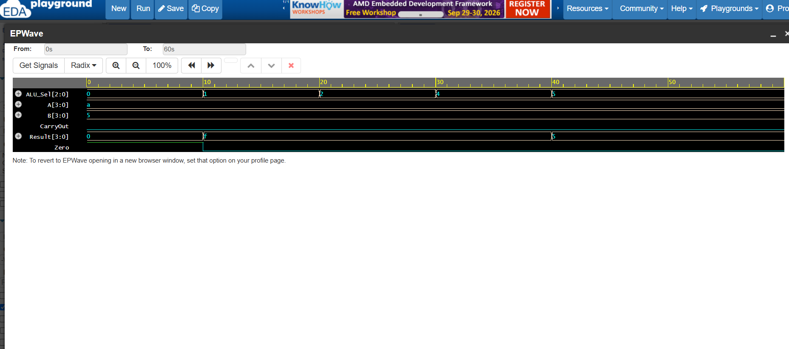

# 4-bit ALU in Verilog | VLSI Project

A 4-bit Arithmetic Logic Unit designed in Verilog HDL supporting 8 operations. Verified with SystemVerilog testbench on EDA Playground.

## 🚀 Features
- 8 Operations: AND, OR, XOR, NOT, ADD, SUB, Left Shift, Right Shift
- Flags: CarryOut, Zero flag detection
- Input: Two 4-bit operands (A, B)

## 🛠 Tools
- Verilog HDL
- EDA Playground - Icarus Verilog 12.0
- EPWave for waveform analysis

## 📊 Simulation
- A = 10 (1010), B = 5 (0101)
- ALU_Sel = 0->5 tested, Result verified

## 📸 Waveform

## ▶️ How to Run
1. Open edaplayground.com
2. Paste `alu_4bit.v` in design.sv
3. Paste `tb_alu.v` in testbench.sv
4. Select Icarus Verilog 12.0 & Run with EPWave

## 👤 Author
**Akash B KOLUR** | ECE Student | VLSI Enthusiast | Bangalore
Aspiring ASIC Design Engineer  

#VLSI #Verilog #ASIC #DigitalDesign
